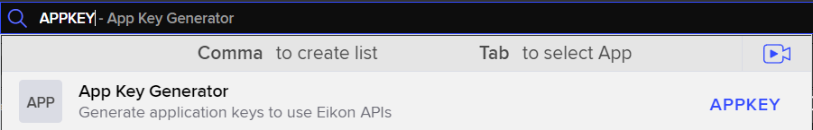

Created for version 0.0.1.1105 of EikonDownloader

```{r, include = FALSE}
knitr::opts_chunk$set(
  collapse = TRUE,
  comment = "#>"
)
library(lemon)
knit_print.data.frame <- lemon_print
devtools::load_all()
```

### Downloading Refintiv/Eikon and Getting an App Key

First of all we need to download a desktop application, both the Eikon Terminal or the newer
[Refinitiv Workspace](https://www.refinitiv.com/en/products/refinitiv-workspace/download-workspace) works
fine. The desktop application is needed to both authenticate the user and gain access to the Eikon API.


After that is in order it is time to get an app_key, this is done by starting up the Eikon Terminal or Refinitiv Workspace
and typing in APPKEY in the search bar.




After that you should see a window like this, where you can register an application. Type in some displayname check off Eikon Data API and click register.


Further down on the page you will now get an app_key, that can be used with the EikonDownloader package.


## Installing EikonDownloader

To install the EikonDownloader package simply run the following code, binaries for Windows, Mac and Linux are available.
```{r install, eval = FALSE}
install.packages("EikonDownloader", repos = "https://oliverfrisvoll.r-universe.dev")
```
The r-universe repository should contain the newest compiled version of the package, but if you want to compile it yourself
that can be done by running the following code. NB! you would need to have Rtools installed on your computer as well as
working Rust toolchain.
```{r Devtools, eval = FALSE}
devtools::install_github("oliverfrisvoll/EikonDownloader")
```

## Using EikonDownloader

Load the package and set the app_key from earlier.

```{r setup}
library(EikonDownloader)
ek_set_APIKEY("ff375f19768843bdb56dd3c7c3387ee5e98b1d88")
```

### Downloading Data

To download data there are two functions, get_datagrid and get_timeseries. The get_datagrid function is used to download
any field available for a given instrument where instrument can be a whole set of different identifiers, while
get_timeseries only takes RIC as identifier and have a given set of fields available close, open, high, low, volume etc.


#### get_datagrid
First of lets see how we get the ISIN and IPO date for the company Apple Inc using get_data_grid.
```{r get_datagrid, render=lemon_print}
# The RIC code for Apple Inc is AAPL.O
instruments <- "APPL.O"

# The fields we want to download, in this case ISIN and IPO date. These can be found using the
# Data Item Browser (DIB) app on the Eikon Terminal or Refinitiv Workspace. (Just type in DIB in
# the search bar)
fields <- c("TR.ISIN", "TR.IPODate")

df <- get_datagrid("AAPL.O", c("TR.ISIN", "TR.IPODate"))
head(df)
```


ISIN as well as whole set of other identifiers can be used instead of RIC codes, for example the ISIN for Apple Inc which is US0378331005.
```{r get_datagrid_isin, render=lemon_print}
isin <- "US0378331005"
df <- get_datagrid(isin, c("TR.RIC", "TR.IPODate"))
head(df)
```


You can of course ask for an arbitrary amount of fields, as well as instruments. Let's get a whole set of fields for Apple Inc, Microsoft Corp, Alphabet Inc and ExxonMobil Corp.
```{r datagrid_multiple, render=lemon_print}
instruments <- c("AAPL.O", "MSFT.O", "GOOGL.O", "XOM")
fields <- c("TR.PE", "TR.EVMean", "TR.CLOSE", "TR.ASKPRICE", "TR.BIDPRICE")

df <- get_datagrid(instruments, fields)
head(df)
```


We got the data, but the headers are not that nice. Let's change that by changing one of the settings.
```{r datagridclean, render=lemon_print}
df <- get_datagrid(instruments, fields, settings = list(field_name = TRUE))
head(df)
```


To get the date for the given field one can add .DATE to the end of the field name. For some values, for instance earnings, the date would be of the last filing and not the current date. The date is returned as a string in ISO8601 format with included time.

```{r addDate, render=lemon_print}
# Adding a field to the field character vector
fields <- c(fields, "TR.CLOSE.DATE")
df <- get_datagrid(instruments, fields, settings = list(field_name = TRUE))
head(df)
# Parsing the ISO8601 date to a date object
df$TR.CLOSE.DATE <- df$TR.CLOSE.DATE |>
  lubridate::ymd_hms() |>
  as.Date()

head(df)
```


We can also ask for a time series of these fields, passing in date variables. These variables are SDate and EDate, they can be combined with frequency variable (Frq) with a while set of frequencies, the default is daily (D). The date variables can be either a string of a date in ISO8601 format or a date object.
```{r dgtimeseries, render=lemon_print}
df <- get_datagrid(instruments, fields, SDate = "2017-05-01", EDate = "2017-05-05", settings = list(field_name = TRUE))
df$TR.CLOSE.DATE <- df$TR.CLOSE.DATE |>
  lubridate::ymd_hms() |>
  as.Date()
head(df)
```


We can also pass in other arguments, like for instance curn to get the date in a different currency.
```{r dgtimeseries_curn, render=lemon_print}

df <- get_datagrid(
  instruments,
  fields,
  SDate = "2017-05-01",
  EDate = "2017-05-05",
  curn = "EUR",
  settings = list(field_name = TRUE)
)

df$TR.CLOSE.DATE <- df$TR.CLOSE.DATE |>
  lubridate::ymd_hms() |>
  as.Date()
head(df)

```


An example of changing the frequency to weekly.
```{r dgtimeseries_frq, render=lemon_print}

df <- get_datagrid(
  instruments,
  fields,
  SDate = "2017-01-01",
  EDate = "2017-05-05",
  curn = "EUR",
  Frq = "W",
  settings = list(field_name = TRUE)
)

df$TR.CLOSE.DATE <- df$TR.CLOSE.DATE |>
  lubridate::ymd_hms() |>
  as.Date()
head(df)

```


#### get_timeseries

When it comes to the get_timeseries function there really isn't much magic to it, you supply the RIC's, startdate and
enddate. The function will return a data frame with the data. It is slower than get_datagrid, but for some data it
can get data not available in get_datagrid.

```{r get_timeseries, render=lemon_print}
df <- get_timeseries(
  instruments,
  startdate = Sys.Date() - 1,
  enddate = Sys.Date(),
  interval = "minute" # if not supplied, default is daily
)

df$TIMESTAMP <- df$TIMESTAMP |>
  lubridate::ymd_hms()

head(df, 10)
```

